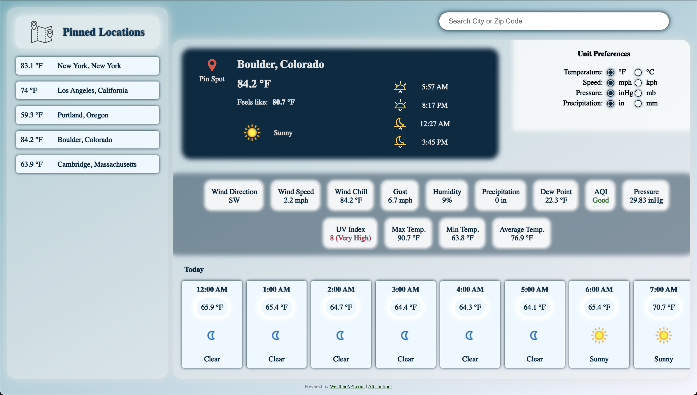

# Weather App

A simple weather application built with HTML, CSS, and JavaScript, bundled using Webpack. This app allows users to search for locations, view weather data, and pin their favorite locations. It utilizes a Weather API for fetching data and incorporates browser APIs like Geolocation and localStorage for enhanced functionality.

## Features

- Search for locations
- View current weather and forecast
- Pin favorite locations for quick access
- Responsive design for desktop and mobile devices
